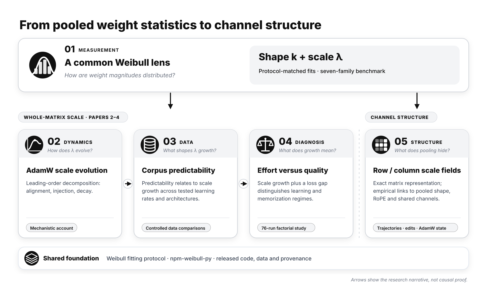

# Transformer Weight Statistics & Analysis

[](https://pypi.org/project/npm-weibull-py/)
[](https://pypi.org/project/npm-weibull-py/)
[](https://huggingface.co/datasets/TiexinDing/NPM-Weibull-DATABASE-v9_1)
[](LICENSE)

Statistical analysis of Transformer weights, from pooled magnitude distributions to channel-level structure: code, data and the `npm-weibull-py` library for five papers.

<p align="center"></p>

| # | Paper | arXiv | Code and data |
|---|---|---|---|
| 1 | A Two-Parameter Weibull Framework for Diagnosing Transformer Weight Distributions | [2605.18898](https://arxiv.org/abs/2605.18898) | [`npm_weibull/`](npm_weibull/), [`database_v9_1/`](database_v9_1/) |
| 2 | Weibull Weight-Scale Parameter Evolution under AdamW Training Dynamics | [2606.19367](https://arxiv.org/abs/2606.19367) | [`Weibull_WeightScale_dynamics/`](Weibull_WeightScale_dynamics/) |
| 3 | Data Predictability Shapes Weibull Weight-Scale Growth in Transformer Training | [2608.23573](https://arxiv.org/abs/2608.23573) | [`Data_Predictability_WeightScale/`](Data_Predictability_WeightScale/) |
| 4 | Weight-Scale Growth Tracks Training Effort, Not Learning Quality | on hold | [`WeightScale_Training_Effort/`](WeightScale_Training_Effort/) |
| 5 | A Mesoscopic View of Transformer Weights Through Row and Column Scale Fields | [2609.35852](https://arxiv.org/abs/2609.35852) | [`scale_field/`](scale_field/) |

All papers by Tiexin Ding. BibTeX entries are under [Citation](#citation); each companion directory has its own README.

## Paper 1: library and benchmark

| Component | Contents | Where |
|---|---|---|
| `npm-weibull-py` v0.4 | Weibull `(k, λ)` fits and seven core diagnostics (F1–F8, F4/F7 merged) | [`npm_weibull/`](npm_weibull/) · [PyPI](https://pypi.org/project/npm-weibull-py/) · [API](docs/F1_F8_API.md) |
| `DATABASE_v9_1` main cohort | Per-component fits, 12 models from 7 families (Pythia, OLMo-1/2, LLaMA-3, Mistral, Qwen2.5, Qwen3) | [`database_v9_1/`](database_v9_1/) · [Hugging Face](https://huggingface.co/datasets/TiexinDing/NPM-Weibull-DATABASE-v9_1) |
| `DATABASE_v9_1` Qwen cohort | 11 Qwen entries (1.5B–14B), including 4 base vs Math-CPT pairs | [`DATABASE_v9_1_qwen_cohort.md`](database_v9_1/DATABASE_v9_1_qwen_cohort.md) |
| Examples | Synthetic fit, benchmark comparison, trajectory decomposition | [`examples/`](examples/) |
| Tests | 47 tests (synthetic, integration, coverage) | [`tests/`](tests/) |

## Install and quick start

```bash
pip install npm-weibull-py            # Python >= 3.9; core deps: numpy, scipy
pip install "npm-weibull-py[torch]"   # + transformers, safetensors (checkpoint extraction)
pip install "npm-weibull-py[plot]"    # + matplotlib
pip install -e ".[dev]"               # development install from a clone
```

```python
from npm_weibull import weibull_fit, compare_to_benchmark

fit = weibull_fit({"edges": edges, "hist": counts}, trim="mid_80")   # F1: Weibull fit of a magnitude histogram
print(fit["k"], fit["lambda"], fit["R2"])

user = {"arch": {"arch": "GQA", "n_q": 32, "n_kv": 8},
        "median_k_per_kind": {"q": 1.14, "k": 1.13, "v": 1.19, "o": 1.19}}
print(compare_to_benchmark(user)["nearest_neighbor"])                 # compare with the 12-model benchmark
```

## Repository layout

| Directory | Contents |
|---|---|
| [`npm_weibull/`](npm_weibull/) | Library: `core/` diagnostics, `utils/`, `workflow/` (`diagnose_model`), `benchmark/` (`DATABASE_v9_1`) |
| [`database_v9_1/`](database_v9_1/) | Database build script and generated CSV / Markdown |
| [`examples/`](examples/), [`tests/`](tests/) | Runnable demos; test suite |
| [`docs/`](docs/) | API reference; series map and its build scripts |
| [`Weibull_WeightScale_dynamics/`](Weibull_WeightScale_dynamics/) | Paper 2 code and derived data |
| [`Data_Predictability_WeightScale/`](Data_Predictability_WeightScale/) | Paper 3 code and derived data |
| [`WeightScale_Training_Effort/`](WeightScale_Training_Effort/) | Paper 4 code and derived data |
| [`scale_field/`](scale_field/) | Paper 5 code, read-outs and data-provenance index |

## Key numbers from Paper 1

| Quantity | Value | Paper |
|---|---|---|
| Initialization anchor, half-normal init, middle-80% fit | `k₀ ≈ 1.2054`, `λ₀ ≈ 0.8875 σ_init` (step 0, 5 Pythia sizes, within 0.13%) | App. A.1 |
| Transmission class `k` (`W_o`, FFN) | 1.186–1.204, cross-family CV 0.51% (12 models) | §2.2 |
| Selection class `k` (`W_q`, `W_k`): separate MHA (OLMo-1/2) | 0.76–0.99 | §2.2 |
| Selection class `k`: GQA (LLaMA-3, Mistral, Qwen2.5, Qwen3) | 1.10–1.16 | §2.2 |
| Selection class `k`: merged `W_qkv` (Pythia) | 1.05–1.18, monotone in `T/τ` | §2.2 |
| Terminal `λ` vs `√(η/λ_wd)`, Pythia | `r = 0.94` (5 sizes); `λ ≈ 0.087 √(η/λ_wd)` | §5.4 |

## Citation

```bibtex
@misc{ding2026weibull,
  title         = {A Two-Parameter Weibull Framework for Diagnosing Transformer Weight Distributions},
  author        = {Ding, Tiexin},
  year          = {2026},
  eprint        = {2605.18898},
  archivePrefix = {arXiv},
  primaryClass  = {cs.LG},
  doi           = {10.48550/arXiv.2605.18898},
  url           = {https://arxiv.org/abs/2605.18898}
}

@misc{ding2026weibulldynamics,
  title         = {Weibull Weight-Scale Parameter Evolution under AdamW Training Dynamics},
  author        = {Ding, Tiexin},
  year          = {2026},
  eprint        = {2606.19367},
  archivePrefix = {arXiv},
  primaryClass  = {cs.LG},
  doi           = {10.48550/arXiv.2606.19367},
  url           = {https://arxiv.org/abs/2606.19367}
}

@misc{ding2026datapredictability,
  title         = {Data Predictability Shapes Weibull Weight-Scale Growth in Transformer Training},
  author        = {Ding, Tiexin},
  year          = {2026},
  eprint        = {2608.23573},
  archivePrefix = {arXiv},
  primaryClass  = {cs.LG},
  doi           = {10.48550/arXiv.2608.23573},
  url           = {https://arxiv.org/abs/2608.23573}
}

@misc{ding2026scalefields,
  title         = {A Mesoscopic View of Transformer Weights Through Row and Column Scale Fields},
  author        = {Ding, Tiexin},
  year          = {2026},
  eprint        = {2609.35852},
  archivePrefix = {arXiv},
  primaryClass  = {cs.LG},
  doi           = {10.48550/arXiv.2609.35852},
  url           = {https://arxiv.org/abs/2609.35852}
}
```

## License

Code and data in this repository are released under the [Creative Commons Attribution 4.0 International (CC BY 4.0)](https://creativecommons.org/licenses/by/4.0/) license, matching the arXiv submission license.

## Contact

Questions, collaboration, or feedback:

- **Email**: tiexinding@gmail.com
- **GitHub issues**: this repository's Issues tab

---

*The repository (`NPM-Weibull-public`) and the library (`npm-weibull-py`) keep their early-development names.*
